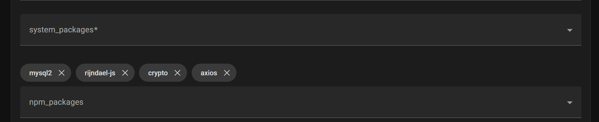
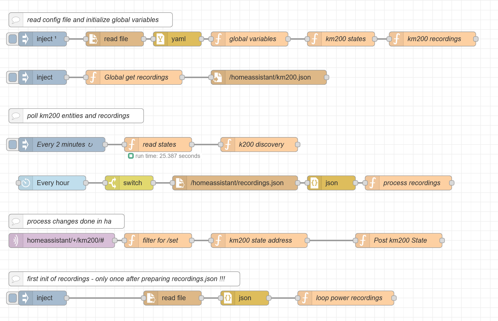
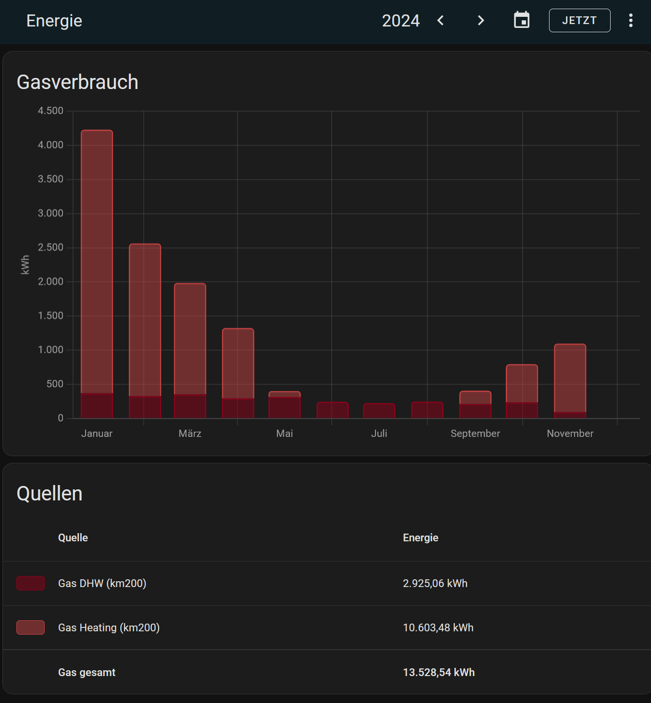

# home-assistant-node-red-km200

This node-red flow will read all data available from the original Buderus/Bosch API.
All enties read are then build in Home Assistant using MQTT discovery.

Aditionally energy consumption data for last 12 months can be loaded into the statistic database when MariaDB Database is used.
Energy consumption for heating and warm water consumption is then available with the energy dashboard. (only tested for gas boilers)

***

The following technical prerequisites are needed:

1.	HA Node-Red addon is installed and active.

2.	MQTT Broker is installed and discovery prefix is set to standard “homeassistant”

3.  MariaDB addon is installed and active for recorder / statistics (only needed for energy statistics)

4.	Node-Red needs 4 additional modules to be installed and referenced in functionGlobalContext in /addon_configs/a0d7b954_nodered/settings.js

  - To access this file I recommend to install the file editor addon. (Config: Enforce Basepath to false) (approx. line 155)

    - functionGlobalContext: {   
       rijndael:require("rijndael-js"),
       crypto:require("crypto"),
       axios:require("axios"),
       mysql2:require("mysql2/promise"),
     },

- Node-Red Config: Add 4 npm packages: rijndael-js, crypto, axios, mysql2  and the npm modules in Node-Red Config and restart NR.

5.  Install in node-red the following module using pellet manager: node-red-contrib-timerswitch

6.	a longterm api access token is generated in HA

7.  To decrypt the km200 API messages you need 2 passwords.
  - The gateway password wich is on a label on boiler or gateway (xxxx-xxxx-xxxx-xxxx)
  - A private Password set by using the MyDevice App where a username and password is set.

***

Before loading the flow you need to define the config file km200.yaml within homeassistant directory: 
https://github.com/tp1de/home-assistant-node-red-km200/blob/main/km200.yaml

The flow should be disabled - you need to enable manually.

*** 

When enabled the first flow (from top) should start and detect all available entities and recordings.
The entities are created with mqtt discovery. 

The second flow creates a file km200.json containing all recordings. (wait until they are found) 
This needs only to be done once.
The recordings need a file recordings.json which is a copy of km200.json you need to prepare by selecting the entities you need and changing the names to your wish.
I put my example file here: https://github.com/tp1de/home-assistant-node-red-km200/blob/main/recordings.json

**Do not create the recordings.json file short before full hour to avoid running the hourly jobs before you have initialized the data once !!!**

You then need to run the last flow once to read all available records and inset them into the statistics database.
When this done every hour updates (new entries) are added. This is done 2 minutes pas every hour. (km200 needs to prepare the data first).

The km200 entities are updated every 120 second.

***

Any updates within ha while changing values are captured by mqtt topics watched. 
The updates are then send to km200 while encrypting and sending using API interface.

***

When availabe the created energy consumption recordings can be added to the ewnergy dashboard.
When starting approx 12 months of history is available. This timeframe gets extended when running permanently.
When you run the initializing flow again you delete the records.

Energy Dashboard:

