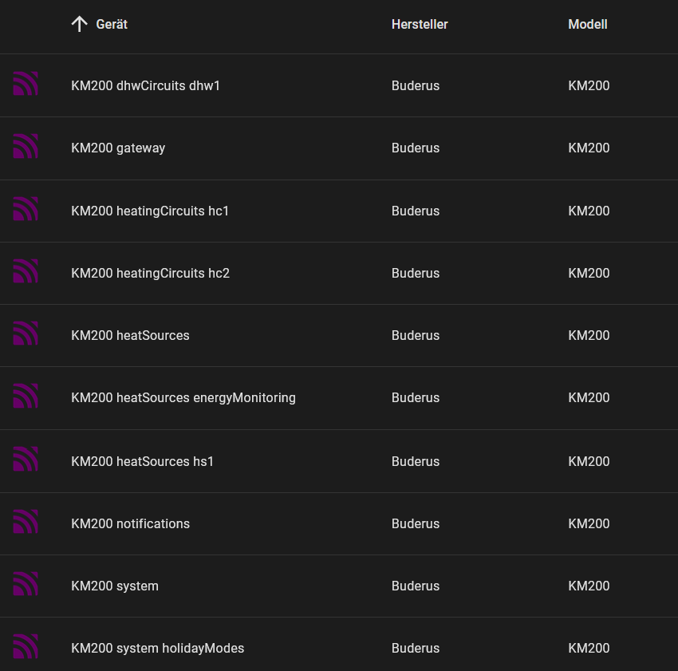

# home-assistant-node-red-km200

This node-red flow will read all data available from the original Buderus/Bosch API.
All enties read are then build in Home Assistant using MQTT discovery.

Aditionally energy consumption data for last 12 months can be loaded into the statistic database when MariaDB Database is used.
Energy consumption for heating and warm water consumption is then available with the energy dashboard. (only tested for gas boilers)

***

The following technical prerequisites are needed:

1.	HA Node-Red addon is installed and active.

2.	MQTT Broker is installed and discovery prefix is set to standard “homeassistant”

3.  MariaDB addon is installed and active for recorder / statistics (only needed for energy statistics)

4.	Node-Red needs 4 additional modules to be installed and referenced in functionGlobalContext in /addon_configs/a0d7b954_nodered/settings.js

To access this file I recommend to install the file editor addon. (Config: Enforce Basepath to false)
(approx. line 155)

 functionGlobalContext: {

    rijndael:require("rijndael-js"),
    crypto:require("crypto"),
    axios:require("axios"),
    mysql2:require("mysql2/promise"),
  },

and the npm modules in Node-Red Config and restart NR.

Node-Red Config: Add 4 npm packages: rijndael-js, crypto, axios, mysql2

5.  Install in node-red the following module using pellet manager: node-red-contrib-timerswitch

5.	a longterm api access token is generated in HA

7.  To decrypt the km200 API messages you need 2 passwords.
  - The gateway password wich is on a label on boiler or gateway (xxxx-xxxx-xxxx-xxxx)
  - A private Password set by using the MyDevice App where a username and password is set.

***

Before loading the flow you need to define the config file km200.yaml within homeassistant directory.

With these prerequisites the data processing flow consists of:

in node-red the following module needs to installed using pellet manager: node-red-contrib-timerswitch

The flow will create the following devices within MQTT:

Energy Dashboard:

